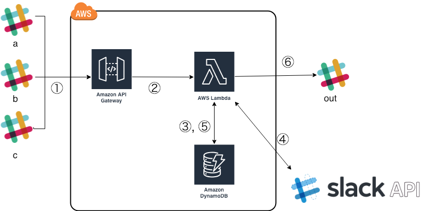

# slagg
API to aggregate multiple slack channels.

## Architecture

## deploy

`make deploy`

## Presentations (Japanese)

- [Slackの投稿をまとめて一つのチャンネルに流すbotを作った](https://core.cohalz.co/entry/2018/12/31/154837)

## Author

[cohalz](https://github.com/cohalz)